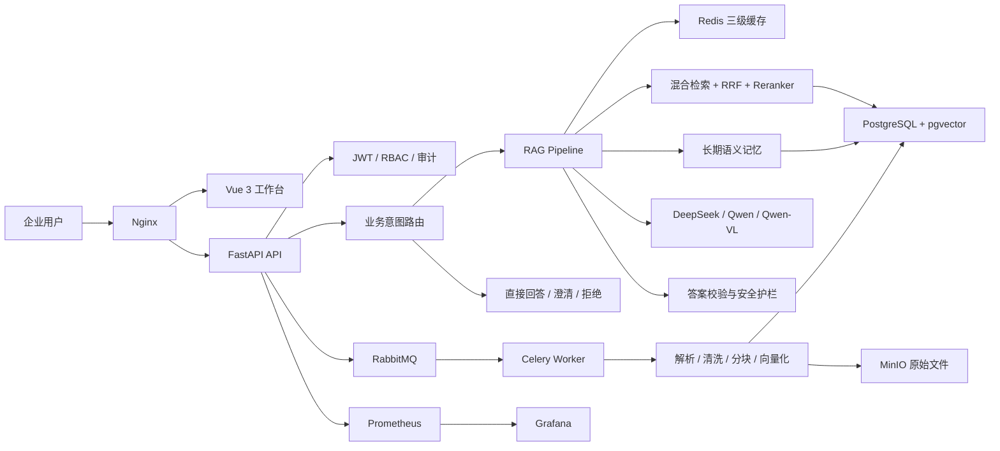
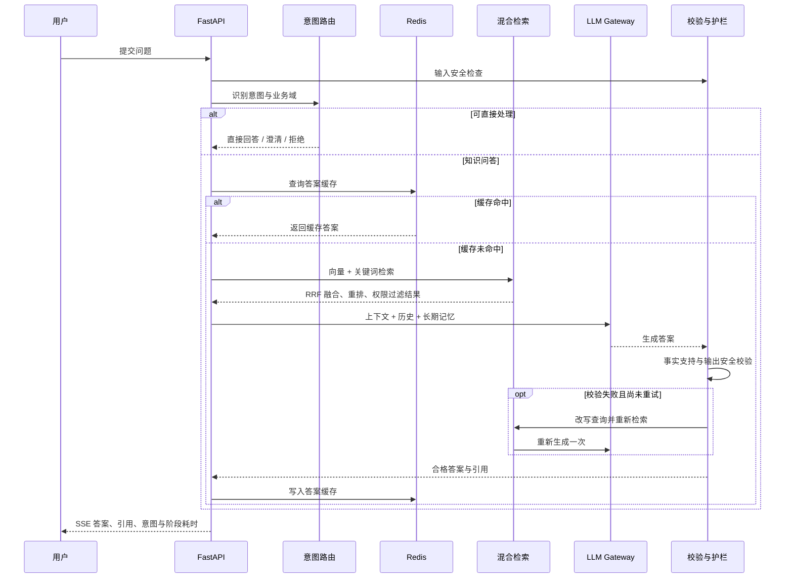

# 企业级多模态知识库 RAG 问答系统

[](https://github.com/rufeng2/-/actions/workflows/ci.yml)


面向企业制度、业务流程和内部资料查询场景的多模态知识库平台。系统支持 Word、PDF、Excel、PPT 和图片的统一摄取，通过**混合检索、业务意图路由、权限过滤、可控反思、长期记忆和生产级可靠性治理**，将一个 RAG 原型补全为可部署、可评测、可观测的企业应用。

> 项目重点不是“接入一个大模型”，而是解决企业 RAG 真正落地时的检索质量、响应延迟、数据权限、回答可信度和外部依赖故障问题。

## 项目亮点

### 1. 不止向量搜索的高质量检索链路

- 同时执行 pgvector 语义检索与 PostgreSQL 关键词检索，兼顾同义表达、制度名称、编号、金额和专业术语。
- 使用 **RRF（Reciprocal Rank Fusion）**合并多路排序，再通过 Reranker 对候选片段进行精排。
- 采用“小块匹配、大块生成”的父子分块策略：子块保证定位精度，父块为大模型补充完整上下文。
- 通过动态召回策略和单文档片段上限控制，避免一个文档垄断上下文。
- 在检索 SQL 内执行部门、知识库和文档可见性过滤，避免先召回越权内容再做应用层过滤。

### 2. 真正可执行的业务意图路由

系统使用“**规则快速路由 + LLM 语义分类 + 低置信度降级**”的两级方案，并让分类结果真正决定后续执行链路。

| 意图 | 执行动作 | 典型请求 |
|---|---|---|
| `knowledge_qa` | 完整 RAG | “差旅住宿标准是多少？” |
| `document_search` | 原文搜索 | “找到信息安全管理制度” |
| `memory_update` | 写入用户记忆 | “以后回答请先给结论” |
| `greeting` / `capability` | 直接回答 | 问候、能力咨询 |
| `clarification` | 请求补充信息 | “这个怎么处理？” |
| `sensitive_action` | 拒绝执行 | 导出密码、删除审计记录 |
| `out_of_scope` | 范围提示 | 与企业知识无关的问题 |

同时识别人力、财务、采购、IT 安全、客户服务、项目管理、数据治理、行政和通用业务域。明确请求通过规则快速处理，复杂请求由 LLM 结合最近对话分类；模型异常或置信度不足时降级到安全的只读检索路径。

### 3. 围绕首字延迟设计的三级缓存

- **意图缓存**：复用相同问题与对话上下文的分类结果。
- **检索缓存**：复用查询、部门、知识库范围和召回参数一致的结果。
- **答案缓存**：复用权限范围一致的完整问答结果。
- 缓存键包含权限范围与索引版本，并使用 SHA-256 摘要，防止跨用户、跨知识库串用数据。
- 文档重新索引后递增版本号，旧缓存自然失效，无需全量扫描删除。
- Redis 不可用时自动绕过缓存，核心问答链路继续运行。

### 4. 次数可控的答案反思闭环

- 对空答案、无上下文、低召回分数、图片问题和高风险问题执行运行时校验。
- 校验答案是否直接回答问题、事实是否得到检索上下文支持。
- 校验失败时生成更合适的检索问题，重新检索和生成，**最多只重试一次**。
- 普通问题保持 SSE 流式输出；高风险问题先缓冲校验再返回，在首字延迟和安全性之间做分级权衡。
- 校验器不可用时记录指标并按降级策略处理，避免形成新的级联故障。

### 5. 企业级安全、可靠性与可观测性

- Prompt Injection、敏感信息、危险操作和输出内容安全检查。
- JWT、RBAC、部门与知识库权限、Chunk 级权限和审计日志。
- 文件扩展名、MIME、文件签名、大小校验，并预留 ClamAV 恶意文件扫描能力。
- 模型调用超时、异步熔断器，以及 DeepSeek 与通义千问之间的故障切换。
- PostgreSQL、Redis、RabbitMQ、MinIO 独立健康探测与能力级降级。
- Prometheus 记录请求、缓存、意图、反思和 RAG 各阶段耗时；Grafana 提供运营面板。
- Alembic 数据迁移、备份恢复脚本、发布检查清单和恢复演练文档。

## 系统架构



## 一次问答如何执行



## 多模态文档摄取

文档上传接口只负责安全校验、存储和投递任务，耗时的解析与索引由 Celery 异步完成：

1. 校验文件名、扩展名、MIME、文件签名和文件大小。
2. 将原始文件保存到 MinIO 或本地存储。
3. 按文件类型提取正文、页码、工作表、幻灯片、表格和图片。
4. 使用 Qwen-VL 对图表、流程图和图片进行客观内容提取。
5. 清洗文本、删除低质量片段并生成文档质量报告。
6. 构建父子分块，同时生成文本向量和多模态向量。
7. 将 Chunk、元数据、权限和向量写入 PostgreSQL/pgvector。
8. 更新文档状态并递增索引缓存版本。

## 长期语义记忆

系统除了保存当前会话历史，还支持用户级跨会话记忆：

- 显式偏好，例如“回答时先给结论”。
- 用户部门、岗位等工作上下文。
- 历史任务摘要及其语义向量。
- 偏好优先召回，其余记忆按向量相似度和重要度召回。
- 记忆按用户 ID 隔离，并设置相似度阈值、数量上限和敏感信息过滤。

## 可观测性

RAG 不是一个黑盒。系统为关键阶段记录独立耗时和业务指标：

| 维度 | 指标示例 |
|---|---|
| API | 请求量、状态码、接口耗时、并发量 |
| 延迟 | 意图识别、记忆召回、检索、重排、生成、校验、TTFT |
| 缓存 | 意图/检索/答案缓存命中、未命中、写入、异常 |
| RAG | 召回数量、重排数量、意图分布、反思通过与重试 |
| 依赖 | PostgreSQL、Redis、RabbitMQ、MinIO 健康状态 |
| 安全 | 限流、危险请求、认证失败和审计事件 |

仓库内提供 Prometheus 告警规则和 Grafana Dashboard，可用于定位“慢在检索还是模型”“缓存是否生效”“某个依赖是否导致能力降级”等问题。

## 评测与压力测试

项目内置可重复执行的质量与性能验证资产：

- `demo_data/retrieval_recall_test_pack/`：6 份企业制度文档与 50 道召回测试题。
- 支持评估 Recall@K、MRR、期望文档、期望 Chunk、页码命中和答案关键词覆盖。
- `tests/load/locustfile.py`：RAG 在线问答压力测试脚本。
- `data/load_results/`：10、50、100、200 用户场景的 Locust 结果文件。
- `tests/`：覆盖业务意图、RAG 特性、流式策略、可靠性、安全、评测、迁移、部署和前端视觉契约。

> 仓库不使用未经验证的“准确率提升百分比”。实际效果应在指定模型、文档集、硬件和并发配置下重新运行评测，并以 Recall@K、MRR、TTFT、P95/P99 和失败率为准。

## 技术栈

| 层级 | 技术 |
|---|---|
| 前端 | Vue 3、TypeScript、Vite、Element Plus、Pinia |
| API | Python 3.12、FastAPI、Pydantic、SSE |
| RAG 编排 | 自研 Pipeline、LangChain Runnable |
| 模型 | DeepSeek、通义千问、Qwen-VL |
| 检索 | PostgreSQL 16、pgvector、全文检索、RRF、Reranker |
| 基础设施 | Redis、RabbitMQ、Celery、MinIO、Nginx |
| 运维 | Docker Compose、Alembic、Prometheus、Grafana、GitHub Actions |

## 前端功能

- 企业工作台式会话界面、历史会话与知识库范围选择。
- SSE 流式回答、Markdown 渲染、代码高亮和引用来源展示。
- 文档上传、处理状态、质量信息和重新索引。
- 图片上传与多模态问答。
- RAG 离线评测和管理员运营页面。
- 桌面端、平板和移动端响应式布局。

## 快速启动

### 1. 环境要求

- Docker 与 Docker Compose
- DeepSeek 或 DashScope API Key（至少配置一个；图片分析需要 DashScope）

### 2. 配置环境变量

```bash
cp .env.example .env
```

编辑 `.env`，至少修改默认密钥、管理员密码，并配置模型 API Key。生产环境不要使用示例默认值。

### 3. 构建前端

```bash
cd frontend
npm ci
npm run build
cd ..
```

### 4. 启动服务

```bash
docker compose up -d --build
```

### 5. 访问入口

| 服务 | 地址 |
|---|---|
| Web 工作台 | <http://localhost:8080> |
| FastAPI 文档 | <http://localhost:8000/docs> |
| 健康检查 | <http://localhost:8000/api/health> |
| Prometheus 指标 | <http://localhost:8000/metrics> |
| MinIO Console | <http://localhost:9001> |
| RabbitMQ Console | <http://localhost:15672> |

## 本地开发

后端：

```bash
python -m venv .venv
# Windows: .venv\Scripts\activate
# Linux/macOS: source .venv/bin/activate
pip install -r backend/requirements.txt
pip install -r backend/requirements-langchain.txt
uvicorn backend.main:app --reload --port 8000
```

前端：

```bash
cd frontend
npm ci
npm run dev
```

## 验证项目

```bash
# 后端与契约测试
pytest -q

# 前端类型检查与生产构建
cd frontend
npm run build

# Docker Compose 配置检查
docker compose config --quiet
```

压力测试示例：

```bash
locust -f tests/load/locustfile.py --host http://localhost:8000
```

## 主要目录

```text
.
├── backend/
│   ├── api/                 # HTTP API、认证、问答、文档和运营接口
│   ├── core/                # RAG 主流程
│   ├── langchain_app/       # Retriever、Prompt 与 Runnable Chain
│   ├── services/            # 检索、路由、缓存、记忆、反思和模型网关
│   ├── security/            # AI 护栏、文件安全与 RBAC
│   ├── tasks/               # Celery 解析、索引、评测和清理任务
│   └── db/                  # ORM、会话与 Alembic 迁移
├── frontend/                # Vue 3 企业知识工作台
├── tests/                   # 功能、可靠性、安全、部署和压力测试
├── demo_data/               # 演示文档与 50 题召回评测包
├── ops/                     # 生产文档、监控、告警和恢复演练
├── scripts/                 # 初始化、备份、恢复、发布与回滚脚本
├── nginx/                   # 反向代理配置
└── docker-compose.yml       # 本地完整服务编排
```

## 设计取舍与边界

- **暂不引入知识图谱**：当前核心问题是文档事实检索；只有出现真实的多跳实体关系查询需求时再增加图谱，避免无效复杂度。
- **暂不实现 NL2SQL**：当前数据来源以文档为主。需要查询业务数据库时，应使用只读账号，并增加 SQL AST 校验、表级白名单、行数和超时限制。
- **GitHub 发布不等于公网部署**：本仓库包含源码、CI 和部署配置；公网生产运行仍需要服务器、域名、HTTPS、正式密钥、持久化存储、备份和监控环境。
- **生产安全以部署配置为准**：启用生产模式后，系统会检查默认密钥、默认密码和危险配置，但运维侧仍需使用 Secret 管理与最小权限网络策略。

## 进一步了解

- [生产部署指南](ops/PRODUCTION.md)
- [发布检查清单](ops/RELEASE_CHECKLIST.md)
- [恢复演练](ops/RESTORE_DRILL.md)
- [生产可靠性设计](docs/superpowers/specs/2026-07-15-production-reliability-design.md)
- [前端工作台设计](docs/superpowers/specs/2026-07-15-frontend-workspace-refresh-design.md)

## License

MIT
